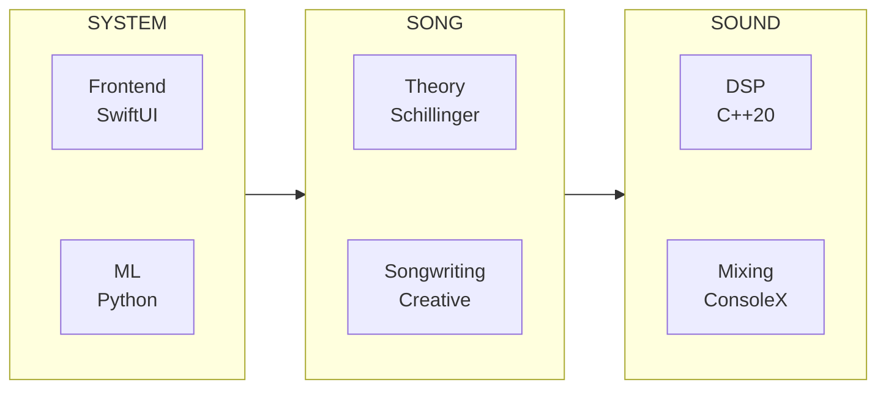

# White Room System

Architecture documentation for **White Room** — a theory-powered music composition environment.

---

## The Concept

Hundreds of years ago, composing began in silence.
You sat in a quiet room. Every tool within reach. A blank sheet of staff paper waiting for the first mark.

White Room is that room — rebuilt for today.

A canvas with depth. Instruments, effects, and theory surrounding you.
Present when needed. Invisible when not.

*In the white room with black curtains, near the station…*

---

## Three Sections

White Room is built on three sections: **Song**, **Sound**, and **System**.

### [Song](./song/)
Your composition. Theory and craft combined.

- **[Theory](./song/theory/)** — Schillinger System
  - Rhythm resultants and interference patterns
  - Melodic contour and motivic development
  - Harmonic progressions and voice leading
  - Orchestration and form

- **[Songwriting](./song/songwriting/)** — Creative Application
  - Song structure and arrangement
  - Hook construction
  - Emotional arc design

### [Sound](./sound/)
Your instruments and mix. DSP and routing combined.

- **[DSP](./sound/dsp/)** — Sound Substrate
  - DSP-first architecture (no framework dependencies)
  - Synthesizer engines (Additive, Granular, Modal, Spectral, Chaos)
  - Sample-based instruments with DDSP
  - Cross-platform: iOS, macOS, tvOS, visionOS, Windows, Linux

- **[Mixing](./sound/mixing/)** — ConsoleX
  - Mixer architecture
  - Bus routing (aux, groups, master)
  - Effect chains
  - Channel strips

### [System](./system/)
The application layer. Frontend and ML combined.

- **[Frontend](./system/frontend/)** — Application Layer
  - SwiftUI interface
  - XCFramework integration
  - Platform support (iOS, macOS, tvOS, visionOS)

- **[ML](./system/ml/)** — Machine Learning
  - Composition assistance
  - Audio analysis
  - Style modeling

---

## Architecture Overview

---

## What This Is

This is a **System Atlas** — public architecture documentation for a private codebase.

- **What's here**: Architecture, design decisions, patterns, technology choices
- **What's not here**: Source code, algorithms, presets, implementation details

---

## Technology Stack

| Pillar | Layer | Technologies |
|--------|-------|-------------|
| Song | Theory | Swift, Schillinger algorithms |
| Song | Songwriting | Swift |
| Sound | DSP | Pure C++20, DDSP, real-time audio |
| Sound | Mixing | SwiftUI, Combine, AUv3 hosting |
| System | Frontend | Swift, SwiftUI, Combine, XCFramework |
| System | ML | Python, ML models |

---

## Platform Strategy

Designed under the strictest constraints.

White Room was engineered to run on platforms that do not allow external audio plugins. This forced the system to contain its entire synthesis, effects, and composition engine internally.

That decision produced a portable architecture where every instrument and effect is part of the core engine rather than an external dependency.

The result is a system that runs consistently across:

**Apple platforms:** iOS, macOS, tvOS, visionOS
**Desktop platforms:** Windows, Linux
**Mobile platforms:** iOS, iPadOS

**Plugin formats supported:**

AUv3 • VST3 • CLAP • LV2

By removing external dependencies, White Room ensures consistent sound, deterministic playback, and seamless cross-platform portability.

---

## License

Documentation only. All implementation code remains proprietary.
