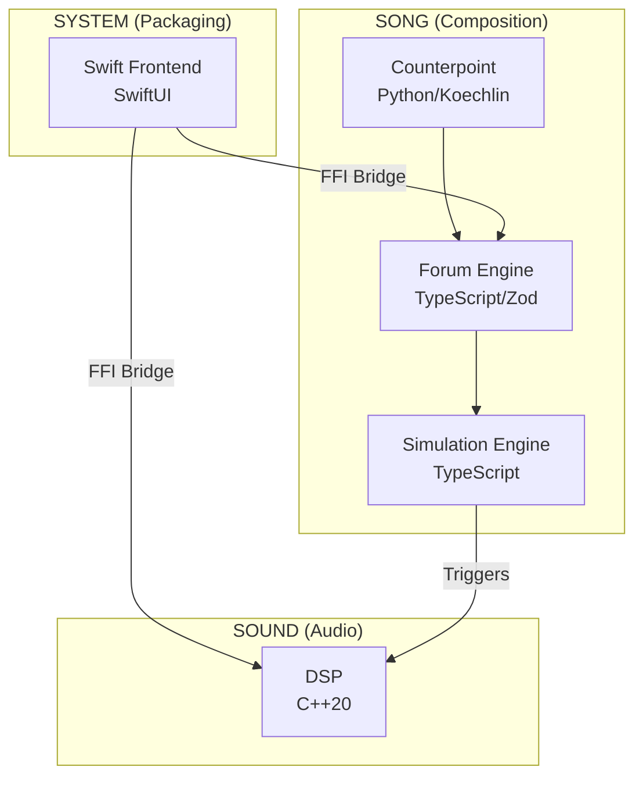

# White Room System

Architecture documentation for **White Room** — a theory-powered music composition environment.

---

## The Concept

Hundreds of years ago, composing began in silence.
You sat in a quiet room. Every tool within reach. A blank sheet of staff paper waiting for the first mark.

White Room is that room — rebuilt for today.

A canvas with depth. Instruments, effects, and theory surrounding you.
Present when needed. Invisible when not.

<br>

<div align="center">
*In the white room with black curtains, near the station…*

<sub>Pete Brown, "White Room" (Cream, 1968)</sub>
</div>

<br>

---

## Project Status

**Working prototype, not yet released.**

White Room is built and running — [synthesis engines](./sound/dsp/), [Schillinger composition](./song/theory/), [composition engine](./song/engine/), [cross-platform audio](./sound/dsp/).

**Current focus:** UI/UX Experience

---

## Three Sections

White Room is built on three sections: **Song**, **Sound**, and **System**.

### [Song](./song/)
Your composition. Theory, engine, and craft combined.

- **[Theory](./song/theory/)** — Schillinger System
  - Rhythm resultants and interference patterns
  - Melodic contour and motivic development
  - Harmonic progressions and voice leading
  - Orchestration and form

- **[Composition Engine](./song/engine/)** — BettaFish-MiroFish Layer
  - Forum Engine: Multi-member deliberation (6 Musical Specialists)
  - Simulation Engine: Temporal state evolution
  - Ensemble Members: Bass, Harmony, Lead, Counterline, Texture
  - Renderer/Realizer: Simulation to musical output

- **[Songwriting](./song/songwriting/)** — Creative Application
  - Song structure and arrangement
  - Synths, Samplers, Orchestral, Keys, Drums
  - Hook construction
  - Emotional arc design

### [Sound](./sound/)
Your instruments and mix. DSP and routing combined.

- **[DSP](./sound/dsp/)** — Sound Substrate
  - DSP-first architecture (no framework dependencies)
  - 27 instruments across 5 categories, powered by 10+ synthesis engines
  - 15+ effects

- **[Mixing](./sound/mixing/)** — ConsoleX Mixer Architecture
  - Bus routing (aux, groups, master)
  - Effect chains
  - Channel strips

### [System](./system/)
The packaging layer. Frontend and optional ML combined.

- **[Frontend](./system/frontend/)** — Application Layer
  - SwiftUI interface
  - XCFramework integration
  - Platform support (iOS, macOS, tvOS, visionOS)

- **[ML](./system/ml/)** — Machine Learning (Optional)
  - Composition assistance
  - Audio analysis
  - Style modeling

---

## Architecture Overview

### Three Sections (Conceptual)

```
SYSTEM (Packaging)
    │
    ▼
SONG (Composition)
    │
    ▼
SOUND (Audio)
```

### Actual Data Flow

```
┌─────────────────────────────────────────────────────────────┐
│  SWIFT FRONTEND (Application Layer)                         │
│  └── SwiftUI interface, XCFramework integration             │
└─────────────────────────────────────────────────────────────┘
        │                           │
        │ FFI                       │ FFI
        ▼                           ▼
┌───────────────────────┐   ┌─────────────────────────────────┐
│  BETTAFISH-MIROFISH   │   │  DSP (Sound Substrate)          │
│  ┌─────────────────┐  │   │  ┌─────────────────────────────┐│
│  │ Forum Engine    │  │   │  │ Synthesis Engines (C++20)   ││
│  │ (TypeScript)    │  │   │  │ - FM, Wavetable, Additive   ││
│  └─────────────────┘  │   │  │ - Granular, Physical Model  ││
│  ┌─────────────────┐  │   │  │ - Spectral, DDSP, Chaos     ││
│  │ Simulation      │──┼──►│  └─────────────────────────────┘│
│  │ (TypeScript)    │  │   │  ┌─────────────────────────────┐│
│  └─────────────────┘  │   │  │ Effects (15+)               ││
│  ┌─────────────────┐  │   │  │ - Reverb, Delay, Chorus     ││
│  │ Counterpoint    │  │   │  │ - Distortion, EQ, Dynamics  ││
│  │ (Python)        │  │   │  └─────────────────────────────┘│
│  └─────────────────┘  │   └─────────────────────────────────┘
└───────────────────────┘
```

**Key Connections:**
- **Swift ↔ BettaFish**: FFI bridge for composition SDK calls
- **Swift ↔ DSP**: Direct FFI bridge for real-time audio control
- **BettaFish → DSP**: Composition engine triggers synthesis



### [Composition Engine](./song/engine/) (BettaFish-MiroFish)

The Composition Engine implements theory as executable code:

```
User Intent
    ↓
Intent Interpretation
    ↓
Musical Specialists (6): Structure | Harmony | Rhythm | Motif | Emotion | Expression
    ↓
Forum Engine (BettaFish): Multi-member deliberation → CompositionPlanIR
    ↓
Simulation Engine (MiroFish): Temporal state evolution → SimulationTimeline
    ↓
Counterpoint Engine (Python): Koechlin voice-leading, species rules
    ↓
Ensemble Members (9): Bass | Harmony | Lead | Counterline | Texture | ...
    ↓
Renderer/Realizer: Simulation → PatternIR/SongIR
    ↓
DSP: Audio synthesis triggered by composition
```

**Technologies:**
- **Forum Engine**: TypeScript + Zod schemas + Vitest tests
- **Simulation Engine**: TypeScript with deterministic state evolution
- **Counterpoint**: Python implementation of Koechlin's system
- **FFI Bridge**: Swift ↔ TypeScript/Python via native bridges

---

## What This Is

This is a **System Atlas** — public architecture documentation for a private codebase.

- **What's here**: Architecture, design decisions, patterns, technology choices
- **What's not here**: Source code, algorithms, presets, implementation details

### Why This Exists

I'm Bret Bouchard. I've been building White Room for 3+ years as a solo developer. This System Atlas documents the architecture for:

- **Hiring managers** — See the engineering behind the product
- **Potential collaborators** — Understand the architecture before conversations
- **Future me** — Document decisions while I still remember why I made them

The private codebase is available for review under NDA.

---

## Technology Stack

| Section | Layer | Technologies | Purpose |
|---------|-------|--------------|---------|
| Song | [Theory](./song/theory/) | Swift, Schillinger algorithms | Mathematical composition |
| Song | [Engine](./song/engine/) | TypeScript, Zod, Vitest | BettaFish-MiroFish SDK (Forum + Simulation) |
| Song | [Counterpoint](./song/engine/) | Python, Koechlin system | Voice-leading, species counterpoint |
| Song | [Songwriting](./song/songwriting/) | Swift | Creative application |
| Sound | [DSP](./sound/dsp/) | Pure C++20, DDSP, real-time audio | Synthesis engines |
| Sound | [Mixing](./sound/mixing/) | SwiftUI, Combine, AUv3 hosting | ConsoleX mixer |
| System | [Frontend](./system/frontend/) | Swift, SwiftUI, Combine, XCFramework | Application layer |
| System | [ML](./system/ml/) | Python, ML models | Optional assistance |

---

## Platform Strategy

Designed under the strictest constraints.

White Room was engineered to run on platforms that do not allow external audio plugins. This forced the system to contain its entire synthesis, effects, and composition engine internally.

That decision produced a portable architecture where every instrument and effect is part of the core engine rather than an external dependency.

The result is a system that runs consistently across:

**Apple platforms:**
iOS, macOS, tvOS, visionOS
</br>
**Desktop platforms:**
Windows, Linux
</br>
**Mobile platforms:**
iOS, iPadOS
</br>
**Plugin formats supported:**
AUv3 • VST3 • CLAP • LV2

By removing external dependencies, White Room ensures consistent sound, deterministic playback, and seamless cross-platform portability.

---

## License

Documentation only. All implementation code remains proprietary.
