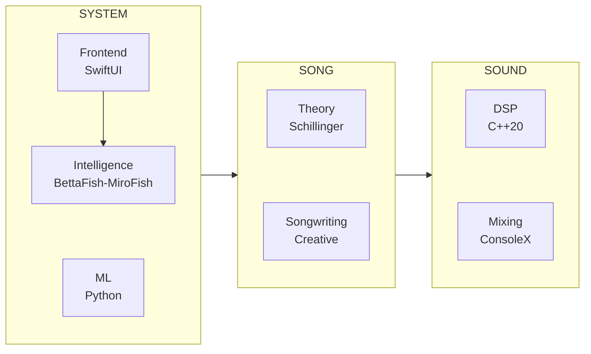

# White Room System

Architecture documentation for **White Room** — a theory-powered music composition environment.

---

## The Concept

Hundreds of years ago, composing began in silence.
You sat in a quiet room. Every tool within reach. A blank sheet of staff paper waiting for the first mark.

White Room is that room — rebuilt for today.

A canvas with depth. Instruments, effects, and theory surrounding you.
Present when needed. Invisible when not.

*In the white room with black curtains, near the station…*

---

## Project Status

**Working prototype. Not yet released.**

White Room is built and running — synthesis engines, Schillinger composition, multi-agent intelligence, cross-platform audio. The backend is solid. Current focus: UI/UX polish.

---

## Three Sections

White Room is built on three sections: **Song**, **Sound**, and **System**.

### [Song](./song/)
Your composition. Theory and craft combined.

- **[Theory](./song/theory/)** — Schillinger System
  - Rhythm resultants and interference patterns
  - Melodic contour and motivic development
  - Harmonic progressions and voice leading
  - Orchestration and form

- **[Songwriting](./song/songwriting/)** — Creative Application
  - Song structure and arrangement
  - Synths, Samplers, Orchestral, Keys, Drums
  - Hook construction
  - Emotional arc design

### [Sound](./sound/)
Your instruments and mix. DSP and routing combined.

- **[DSP](./sound/dsp/)** — Sound Substrate
  - DSP-first architecture (no framework dependencies)
  - 27 instruments across 5 categories, powered by 10+ synthesis engines
  - 15+ effects

- **[Mixing](./sound/mixing/)** — ConsoleX Mixer Architecture
  - Bus routing (aux, groups, master)
  - Effect chains
  - Channel strips

### [System](./system/)
The application layer. Frontend, Intelligence, and ML combined.

- **[Frontend](./system/frontend/)** — Application Layer
  - SwiftUI interface
  - XCFramework integration
  - Platform support (iOS, macOS, tvOS, visionOS)

- **[Intelligence](./system/intelligence/)** — BettaFish-MiroFish Layer
  - Forum Engine: Multi-agent deliberation (6 specialist agents)
  - Simulation Engine: Temporal state evolution
  - Musical Actor Agents: Kick, Bass, Harmony, Lead, Texture
  - Renderer/Realizer: Simulation to musical output

- **[ML](./system/ml/)** — Machine Learning
  - Composition assistance
  - Audio analysis
  - Style modeling

---

## Architecture Overview



### Intelligence Layer (BettaFish-MiroFish)

The Intelligence Layer sits between user intent and musical output:

```
User Intent
    ↓
Intent Interpretation
    ↓
Specialist Agents (6): Structure | Harmony | Rhythm | Motif | Emotion | Expression
    ↓
Forum Engine (BettaFish): Multi-agent deliberation → CompositionPlanIR
    ↓
Simulation Engine (MiroFish): Temporal state evolution → SimulationTimeline
    ↓
Musical Actor Agents (9): Kick | Bass | Harmony | Lead | Counterline | Texture
    ↓
Renderer/Realizer: Simulation → PatternIR/SongIR
    ↓
Audio Output
```

---

## What This Is

This is a **System Atlas** — public architecture documentation for a private codebase.

- **What's here**: Architecture, design decisions, patterns, technology choices
- **What's not here**: Source code, algorithms, presets, implementation details

### Why This Exists

I'm Bret Bouchard. I've been building White Room for 3+ years as a solo developer. This System Atlas demonstrates the depth and complexity of the project for:

- **Hiring managers** — See the engineering behind the product
- **Potential collaborators** — Understand the architecture before conversations
- **Future me** — Document decisions while I still remember why I made them

### What This Shows

If you're evaluating me as a candidate, this repo demonstrates:

| Skill | Evidence |
|-------|----------|
| **Systems Architecture** | 3-layer design (Song → Sound → System) with clean boundaries |
| **Real-time Audio** | Pure C++20 DSP, lock-free processing, cross-platform |
| **AI/Agent Systems** | Multi-agent deliberation, temporal simulation, explainable decisions |
| **Cross-Platform** | iOS, macOS, tvOS, visionOS, Windows, Linux, 4 plugin formats |
| **Music Theory** | Full Schillinger System implementation |
| **Documentation** | Comprehensive architecture docs, decision logs |

The private codebase is available for review under NDA.

---

## Technology Stack

| Section | Layer | Technologies | Purpose |
|---------|-------|--------------|---------|
| Song | Theory | Swift, Schillinger algorithms | Mathematical composition |
| Song | Songwriting | Swift | Creative application |
| Sound | DSP | Pure C++20, DDSP, real-time audio | Synthesis engines |
| Sound | Mixing | SwiftUI, Combine, AUv3 hosting | ConsoleX mixer |
| System | Frontend | Swift, SwiftUI, Combine, XCFramework | Application layer |
| System | Intelligence | TypeScript, Zod, Node.js, Vitest | Multi-agent composition |
| System | ML | Python, ML models | Optional assistance |

---

## Platform Strategy

Designed under the strictest constraints.

White Room was engineered to run on platforms that do not allow external audio plugins. This forced the system to contain its entire synthesis, effects, and composition engine internally.

That decision produced a portable architecture where every instrument and effect is part of the core engine rather than an external dependency.

The result is a system that runs consistently across:

**Apple platforms:** iOS, macOS, tvOS, visionOS
**Desktop platforms:** Windows, Linux
**Mobile platforms:** iOS, iPadOS

**Plugin formats supported:**

AUv3 • VST3 • CLAP • LV2

By removing external dependencies, White Room ensures consistent sound, deterministic playback, and seamless cross-platform portability.

---

## License

Documentation only. All implementation code remains proprietary.
